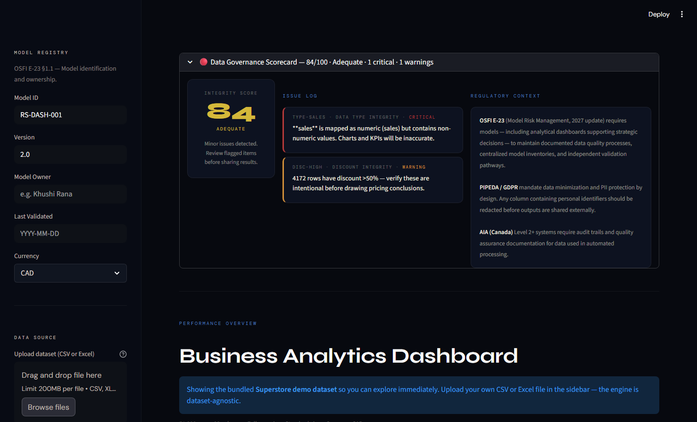

# Universal Analytics Engine — RegTech BI Platform

A dataset-agnostic business intelligence platform with a built-in data governance layer aligned to OSFI Guideline E-23 model risk expectations and Canada's AIA Directive. Upload any tabular dataset, map your columns, and receive both standard exploratory analytics and a regulatory governance report — including a downloadable three-party sign-off compliance document.

**Live tool:** https://retail-sales-dashboard-2glrgrkfmhd5py98ah7jbc.streamlit.app/  
*(Hosted on Streamlit Community Cloud — may take 30 seconds to load on first visit. The bundled sample retail dataset loads automatically so the dashboard is populated immediately; upload your own CSV or Excel to analyze your data — the tool itself is dataset-agnostic.)*

---

## What this tool does

The platform takes a generic transaction-level dataset and produces two parallel outputs:

**Analytics layer** — standard exploratory data analysis, KPIs, and visualizations of the kind you would expect from a BI tool:
- Revenue and profit KPIs with margin and average-order metrics
- Category, regional, and temporal trend analysis
- Strategic views including a BCG-quadrant scatter, margin-by-sub-category, and discount-impact diagnostics
- Geographic choropleth and animated market-over-time views
- Programmatically derived business insights (revenue trend, discount drag, concentration risk, margin spread, loss-making rate)

**Governance layer** — a Model Risk Governance assessment of the dataset before any analysis runs:
- **Automated PII detection** across column names (Name, Email, Phone, Address, DOB, SIN/SSN) with one-click redaction
- **Proxy bias flagging** for geographic columns (postal code, FSA, neighbourhood) that may proxy for protected characteristics under the Canadian Human Rights Act and AIA GBA+
- **Data integrity scorecard** (0–100) scoring missing values, type mismatches, negative-sales anomalies, date parsing failures, discount outliers, and column skew
- **AIA Impact Level proxy estimate** based on dataset characteristics
- **Model registry inputs** (Model ID, Version, Owner, Last Validated) aligned to OSFI E-23 §1.1
- **Analytical transparency tab** documenting every method's formula and flag threshold (aligned to AIA Level 2 explainability requirements)
- **Downloadable compliance report** with three-party sign-off structure (Model Risk Officer review)

The combination — analytics plus governance — is the differentiator. The point is that *the moment you start analyzing data with any view to model deployment, governance review should be embedded, not bolted on later.*

---

## What I designed

The governance architecture of this tool is mine. I designed:

- **The PII detection logic** — pattern matching across column names, the labels (Name, Email, Phone, Address, DOB, SIN/SSN), and the redaction approach (replacement with anonymised sequence IDs)
- **The proxy bias detection rules** — which geographic and demographic columns raise flags, with the regulatory reasoning embedded as plain-language explanations
- **The data integrity scorecard methodology** — what dimensions are scored (completeness, type integrity, validity, temporal integrity, discount integrity, fairness, privacy, representativeness), the penalty weights for each, and the rating thresholds
- **The AIA Impact Level proxy scoring** — mapping dataset characteristics (presence of customer/country/date columns, PII presence, dataset size) to Levels I–IV
- **The analytical methods inventory** — which BI methods are surfaced with what formula, threshold, and regulatory rationale
- **The compliance report format** — seven sections, model registry block, sign-off structure, and disclaimer framing
- **The OSFI E-23 alignment** throughout — model owner field, validation date, breach threshold reasoning, and the regulatory-context panel embedded in the governance scorecard

## What I did not build from scratch

I designed the governance architecture — the detection rules, scoring methodology, and report structure. The Python/Streamlit/Pandas/Plotly implementation was AI-assisted: the code handles file upload and column auto-detection, runs the governance checks I designed, generates the visualizations, and assembles the compliance report.

---

## Why this matters

OSFI Guideline E-23 (the 2027 update) raises model risk management expectations for federally regulated financial institutions — and explicitly extends "model" to cover analytical tools and dashboards supporting strategic decisions, not just statistical credit and capital models. Most BI tools today have no concept of model risk governance built in. Risk review happens after-the-fact, by a different team, often using a different tool.

This is a sketch of what it looks like to embed Canadian regulatory expectations into an analytics workflow from the first upload — PII detection before sharing, proxy bias flagging before segmentation, integrity scoring before insight generation, and a compliance report at the end.

The tool is a proof of concept, not an enterprise solution. It demonstrates the architecture of regulation-embedded analytics for a Canadian financial-sector context. A production version would require integration with model inventories, identity and access management, formal validation pipelines, and actual regulatory review.

---

## Standards referenced

- **OSFI Guideline E-23** — Model Risk Management (Office of the Superintendent of Financial Institutions, 2027 update)
- **OSFI Guideline B-13** — Technology and Cyber Risk Management
- **Canada AIA** — Directive on Automated Decision-Making
- **PIPEDA** and Quebec Law 25
- **Canadian Human Rights Act** (proxy bias context)
- **NIST AI Risk Management Framework 1.0**

---

## Disclaimer

This is an educational reference tool built by a student, based on publicly available frameworks and my own research and interpretation. The compliance report it generates is not a formal model validation, audit opinion, legal or financial advice, or a regulatory determination, and the tool is not affiliated with or endorsed by any standards body or regulator. Outputs are based on self-reported inputs only. The AIA Impact Level it produces is a proxy estimate based on dataset structure — complete the official AIA at canada.ca/aia-tool for real public-sector deployments. For OSFI-regulated institutions, consult your Model Risk Officer and refer directly to OSFI Guidelines E-23 and B-13. For real decisions, consult a qualified professional and primary sources.

A sample dataset is included in the repository for demo purposes only. The tool is dataset-agnostic — upload your own CSV or Excel file via the sidebar.

---

## Contact

Designed and architected by Khushi Rana — Psychology × AI Governance @ University of Waterloo.

- ks2rana@uwaterloo.ca
- linkedin.com/in/khushi-rana
- khushi-rana-website.vercel.app
